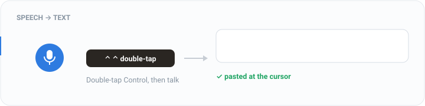
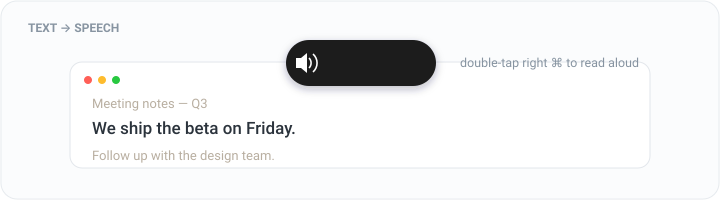

# Dontype (丝语)

[English](README.md) · [中文](README.zh.md) · **日本語** · [한국어](README.ko.md) · [Español](README.es.md) · [Français](README.fr.md)

**Easylii** が手がける、Mac向けのプライバシー第一の音声ディクテーション＋読み上げツール。
欧米向けブランドは **Dontype**（don't type — ただ話すだけ）、中国語名は **丝语**。**Control** をダブルタップで話し始め、もう一度タップで停止——ローカルでの文字起こし、AIによる整文、カーソル位置への自動ペースト。すべてがデバイス上で動作し、あなたの声がMacの外に出ることはありません。

## ハイライト

- **2 in 1：音声 ⇄ テキスト。** 1つのツールで双方向に対応——ディクテーション（音声 → テキスト）**および** 選択した任意のテキストの読み上げ（テキスト → 音声）。ほとんどのツールは片方向しかできません。
- **従量課金APIなし、追加サブスクなし。** 認識は完全に **ローカル** で動作（無料・オフライン・通信不要）。AIによる整文は **すでにお持ちの Claude Code / Codex** をそれぞれのCLI経由で利用——別途のAnthropic APIキーも、トークン単位のAPI課金も不要です。追加で支払うものはなく、どちらも無い場合は文字起こしの生テキストをそのまま出力します（それでも無料）。
- **5枠のクリップボード履歴。** すべてのディクテーション結果と手動でのコピーが、5件の履歴（重複排除・ソースタグ付き）に流れ込みます——いずれかをクリックすれば再びコピーできます。メモリ上のみで保持し、機微なクリップはスキップします。

## 仕組み

```
Double-tap Control to record (tap to stop / Esc = stop without paste)
  → whisper.cpp local recognition (offline; falls back to Apple speech if no model)
  → AI cleanup (Claude API / Claude Code / Codex, auto-fallback; rewrites into fluent sentences)
  → floating result window + copy button
  → auto-paste into the field you were in
```

## デモ

**音声 → テキスト** — Control をダブルタップして話すと、テキストがカーソル位置にペーストされます：



**テキスト → 音声** — テキストを選択して右 ⌘ をダブルタップすると、音声が読み上げます：



**インタラクティブなインストール解説** — [`design/dontype-install-flow.html`](design/dontype-install-flow.html) をブラウザで開くと、初回起動の全体験を確認できます（8画面：ようこそ → プライバシー同意 → 権限 → モデル → ホットキー → 読み上げ → AI → 完了）。

> 上記の2つのデモはアニメーションSVGです（READMEの中で再生されます）。実物については、`Cmd+Shift+5` → Gifski / Kap でアプリの短いGIFを録画してください。リポジトリを公開すれば、GitHub Pages 経由でHTML解説をホストすることもできます。

## 対応する認識言語

> **要点：「言語ごとの認識パック」というものは存在しません。** 1つのwhisperモデルが約99言語をカバーします——言語を設定するか、自動検出を使うだけです。言語ごとに複数のモデルをダウンロードする必要は一切ありません。

**デフォルトで自動検出**（`recognitionLang: auto`）——話している言語を自動で判別し、手動で選ぶ必要はありません。認識言語のドロップダウンには、手動で固定する際の **主要** 言語のみが並びます：

| 区分 | 言語 | 備考 |
|------|-----------|-------|
| **主要**（ドロップダウン内、公式サポート） | English · Chinese (Mandarin) · 日本語 · 한국어 · Spanish · French · German · Italian · Portuguese | turbo ≈ フルの large-v3；安心して宣伝可能 |
| 動作するが注意あり | Cantonese · Thai · Vietnamese など | turbo は広東語/タイ語で明らかに精度が落ちる → `whisperModel` を `large-v3` に切り替え；ドロップダウンには無いが自動検出は認識する |
| 弱い（宣伝対象外） | 低リソース言語 | エラー率が高く、ハルシネーションが起きやすい |

- **turbo と large-v3 の比較**：デフォルトの `large-v3-turbo` は高速で、高リソース言語ではほぼフル品質ですが、低リソース言語（特に広東語・タイ語）では精度が落ちます。より高い多言語精度が必要なら `whisperModel` を `large-v3` に切り替えてください。
- **インターフェース言語**（メニュー / ウィザード）は認識とは別物で、現時点では中国語 / 英語に対応し、それ以外は英語にフォールバックします。日本語 / 韓国語のUIなどは、市場が翻訳作業を正当化できる段階で順次追加できます。

## インストール

**配布インストール（推奨）**：`./make-dmg.sh` が `Dontype.dmg` をビルドします（`install.command` / `PRIVACY.md` / インストール手順を同梱）。インストールするには、DMG内の **install.command** を右クリック → 「開く」を選びます。スクリプトが `/Applications` にコピーし、検疫属性を取り除き（以降はダブルクリックで動作）、デフォルト設定を書き込んで起動します。

**初回起動 ＝ ページ送り式のセットアップウィザード**：ようこそ → **プライバシーポリシー（続行するには同意が必須）** → 権限 → モデル → ホットキー → 読み上げ → AI → 完了。その後はメニューバーの「設定」から **単一ウィンドウの設定パネル** が開きます（もうページ送り式のフローではありません）。

**ローカル開発**：

```bash
cd ~/Documents/SiYu
./build-app.sh          # build + bundle + sign → SiYu.app
open SiYu.app
```

> 注：アプリバンドルは内部的には依然として `SiYu.app` という名前ですが、Finder / 権限 / メニューには `Info.plist` ＋ `Resources/*.lproj` のローカライズによってブランド名 **Dontype**（英語環境）/ **丝语**（中国語環境）が表示されます。
> 署名証明書は `.cert/` に置かれています（**リポジトリには含まれません** — 別途バックアップしてください）。固定の証明書を使うことで、再ビルドをまたいでもアクセシビリティなどのTCC許可が有効に保たれます。

起動すると、メニューバーに **バブルのロゴ** が表示されます。録音中は赤一色に、整文中はオレンジ一色になります。

## クリップボード履歴（最大5件）

メニューバーの「音声入力」セクションには **クリップボード履歴** があります——最大5件、クリックするとクリップボードに戻せます：
- 2つのソースがアイコンで示されます：🌊 本アプリの文字起こし / 📋 手動でコピーしたもの。
- **自動重複排除**：同一の内容は1つだけ保持され、先頭に移動します。
- **メモリ上のみで保持、ディスクには一切書き込まず、終了時にクリア** されます。パスワードマネージャーが機微と判定したクリップボード項目は **スキップ** されます。

## 選択テキストの読み上げ（逆方向）

**任意のアプリ** で、テキストを選択（またはカーソルを先頭に置く）→ **右 ⌘ をダブルタップ** すると、プレミアム音声が **そこから現在のテキストブロックの末尾まで** を読み上げます（オフライン・無料）。読み上げ中は **右 ⌘ をタップ** で一時停止/再開、**Esc** で停止します。
- 下方向への読み上げ：まずアクセシビリティ経由で「フォーカス中フィールドの全文＋選択位置」の取得を試み、選択開始位置からそのテキストブロックの末尾まで読み上げます。取得できない場合（一部のWebページ / ターミナル / Electron）は、**選択範囲のみの読み上げ** にフォールバックします。
- 選択範囲のフォールバック：アクセシビリティで選択を取得できない場合は、Cmd+C を合成してクリップボードを読み上げ、その後 **元に戻します**。
- 設定：設定パネルの「⑧ 選択テキストの読み上げ → 設定」で音声 / 速度 / トリガーキー / プレビューを設定できます。プレミアム音声が無い場合は、システム設定でダウンロードするための入口が用意されています。

## プライバシー

あなたの声がデバイスの外に出ることはありません——収集ゼロ、トラッキングゼロ、アカウント不要、テレメトリなし。任意のAI整文では、**自分で設定した** Claude/Codex アカウントへ **テキストのみ**（音声ではなく）を送信します。完全なポリシーは [`PRIVACY.md`](PRIVACY.md) にあります（バイリンガル、GDPR / CCPA 水準）。初回起動にはプライバシー同意のゲートがあります。

## 設定

AI整文のバックエンドは優先順位に従って自動選択されます：`Claude API (fastest) → Claude Code → Codex → raw passthrough`、失敗時には自動でフォールバックします。最速のAPIを使うには、`ANTHROPIC_API_KEY` を設定するか、`~/.config/siyu/config.json` に `apiKey` を記載してください。キーが無くても動作します：Claude Code / Codex があればあなたのサブスクリプションを使い、どちらも無ければ文字起こしの生テキストを出力します。

`~/.config/siyu/config.json` のフィールド：

| フィールド | 意味 | デフォルト |
|-------|---------|---------|
| `apiKey` | Anthropic APIキー | 空（環境変数にフォールバック） |
| `model` | API整文に使うモデル | `claude-haiku-4-5-20251001` |
| `cleanup` | AI整文を有効化（フィラー検出時のみ自動発動） | `true` |
| `autoPaste` | 結果が出たらカーソル位置に自動ペースト | `true` |
| `whisperModel` | whisper モデルID（`large-v3-turbo` / `large-v3` / `medium` / `small`） | `large-v3-turbo` |
| `recognitionLang` | 認識言語（`auto` / `en` / `zh` / `ja` / `ko` / `es` / `fr` / `de` / `it` / `pt`） | `auto` |
| `uiLang` | インターフェース言語（`auto` / `zh` / `en`） | `auto` |
| `readKey` | 読み上げのトリガーキー（`control`/`fn`/`rightCommand`/`rightOption`/`option`） | `rightCommand` |
| `readVoice` | 読み上げの音声ID（空 = テキスト言語に応じてプレミアム音声を自動選択） | 空 |
| `readRate` | 読み上げ速度 0…1 | `0.5` |

## 構成

| ファイル | 役割 |
|------|----------------|
| `AppDelegate.swift` | メニューバー、フロー統括、クリップボード履歴、権限 |
| `HotkeyMonitor.swift` | グローバルな修飾キーのダブルタップ検出（CGEventTap） |
| `Dictation.swift` | 録音＋認識（whisper優先、Appleにフォールバック） |
| `Whisper.swift` | whisper.cpp バックエンド：モデルディレクトリ、認識言語、常駐サーバー |
| `Cleaner.swift` | AI整文（API / Claude Code / Codex のフォールバックチェーン；文章に書き換え） |
| `ModelDownloader.swift` | whisper モデルのダウンロード（ウィザードへの進捗コールバック） |
| `TextGrabber.swift` | 選択テキストの取得（アクセシビリティ直接＋Cmd+Cフォールバックでクリップボードを復元） |
| `Speaker.swift` | 読み上げエンジン（AVSpeechSynthesizer ＋ プレミアム音声、言語による自動選択） |
| `HotkeySetup.swift` / `ReadSetup.swift` | 開始/停止ホットキー、読み上げのセットアップ（ダブルタップのテストで確認） |
| `Onboarding.swift` | 初回起動の **ページ送り式ウィザード**（プライバシー同意付き）＋メニューの **設定パネル**（2モード、1クラス） |
| `RecallStore.swift` | クリップボード履歴（最大5件、重複排除、メモリ上、機微なクリップはスキップ） |
| `IconRenderer.swift` | メニューバーアイコン＋マイクソースアイコン（実行時に描画するSVGパス） |
| `HUD.swift` | フローティング結果ウィンドウ / ドラッグ可能なピル / 読み上げ波形 |
| `Paster.swift` | クリップボード＋合成 Cmd+V |
| `L.swift` | UIローカライズ（zh/en）· `Config.swift` ランタイム設定 |

`design/dontype-install-flow.html` はインタラクティブなインストールフローのプロトタイプです（デモ用）。

## ロードマップ

- **ストリーミング認識**：話しながらテキスト化（whisper-server はすでに常駐しており、チャンク単位のストリーミングが可能）。
- **CoreML アクセラレーション**：whisper エンコーダーで CoreML を有効化。
- **Developer ID による公証**：署名を切り替えて公証することで、初回起動時の「右クリック → 開く」を不要にする。
